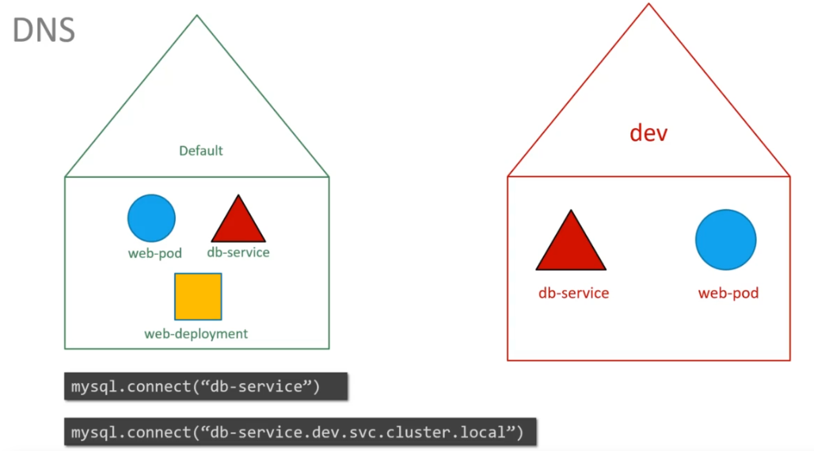

# Kubernetes :- The Production grade container orchestration  Engine 
## Info about Kubernetes
Kubernetes in the most powerfull container orchestration engine <br/>
Its free for everyone <br/>
## Developement  info 
<ul>
	<li> Developed by Google and CNCF  </li>
	<li> 7 June 2014 is the Release date  </li>
	<li> written in Go lang  </li>
	
</ul>

## Kubernetes multinode setup 
###  we have 4 machine , 1 master and 3 worker
## Pre-requisite 

### Disable selinux in all the nodes

```
  [root@master ~]# setenforce  0
  [root@master ~]# sed -i 's/SELINUX=enforcing/SELINUX=disabled/'  /etc/selinux/config
  
 ```
 
 ### Enable the kernel bridge for every system
 ```
 [root@master ~]# modprobe br_netfilter
 [root@master ~]# echo '1' > /proc/sys/net/bridge/bridge-nf-call-iptables
 ```
 ### Disable the swap 
 ```
 [root@master ~]# swapoff  -a
 ```
 ## Installing  docker and kubeadm in all the nodes 
 ```
 [root@master ~]# yum  install  docker kubeadm  -y
 ```
 ## Start service of docker & kubelet in all the nodes 
 ```
 [root@master ~]# systemctl enable --now  docker kubelet
 ```
 ## Do this only on Kubernetes Master 
 We are here using Calico Networking so we need to pass some parameter 
 you can start [Kubernetes_networking](https://kubernetes.io/docs/setup/production-environment/tools/kubeadm/create-cluster-kubeadm/) from this  <br/>
 
```
[root@master ~]# kubeadm  init --pod-network-cidr=192.168.0.0/16
```
### Use the output of above command and paste it to all the worker nodes

## Do this step in master node 
```
[root@master ~]# mkdir -p $HOME/.kube
[root@master ~]#  cp -i /etc/kubernetes/admin.conf $HOME/.kube/config
[root@master ~]# chown $(id -u):$(id -g) $HOME/.kube/config
```

##  Now apply calico project 
```
kubectl apply -f https://docs.projectcalico.org/v3.8/manifests/calico.yaml
```
After this all nodes will be ready in state

## Now you can check nodes status
```
[root@master ~]# kubectl get nodes
NAME                 STATUS   ROLES    AGE     VERSION
master.example.com   Ready    master   11m     v1.12.2
node1.example.com    Ready    <none>   9m51s   v1.12.2
node2.example.com    Ready    <none>   9m25s   v1.12.2
node3.example.com    Ready    <none>   9m3s    v1.12.2
```

Good luck guys !!

## Namespace in Kubernetes 
This entity is basically for making isolation for different users and services in kubernetes <br/>
different users can create their seperate pods, deployment , services and many those are isolated from each other <br/>

##  Namespace facts :
There are 3 namespace which are by default created 
<ul>
	<li> default </li>
	<li> kube-system  </li>
	<li> kube-public </li>
<ul/>

```
[ec2-user@ip-172-31-89-188 ~]$ kubectl get namespaces 
NAME              STATUS   AGE
default           Active   96m
kube-public       Active   96m
kube-system       Active   96m
```

###  Not everything is inside namespaces like  <i> namespaces  </i>  
####  To check list of  api-resources which are present in namespace and which are not
```
[ec2-user@ip-172-31-89-188 ~]$ kubectl api-resources 
NAME                              SHORTNAMES   APIGROUP                       NAMESPACED   KIND
bindings                                                                      true         Binding
componentstatuses                 cs                                          false        ComponentStatus
configmaps                        cm                                          true         ConfigMap
endpoints                         ep                                          true         Endpoints
events                            ev                                          true         Event
limitranges                       limits                                      true         LimitRange
namespaces                        ns                                          false        Namespace
nodes                             no                                          false        Node
persistentvolumeclaims            pvc                                         true         PersistentVolumeClaim
persistentvolumes                 pv                                          false        PersistentVolume
pods                              po                                          true         Pod
```

###  By default we create all resources in default namespace as a kubernetes client  


## Creating namespaces 
###  using  yaml file  
```
[ec2-user@ip-172-31-89-188 ~]$ kubectl create  -f  creans.yml 
namespace/myspace created
[ec2-user@ip-172-31-89-188 ~]$ kubectl get  namespaces 
NAME              STATUS   AGE
default           Active   114m
kube-node-lease   Active   114m
kube-public       Active   114m
kube-system       Active   114m
myspace           Active   6s
```

###  creating namespace using command line 
```
[ec2-user@ip-172-31-89-188 ~]$ kubectl create   namespace  cmdname
namespace/cmdname created
[ec2-user@ip-172-31-89-188 ~]$ kubectl get ns
NAME              STATUS   AGE
cmdname           Active   5s
default           Active   116m
kube-node-lease   Active   116m
kube-public       Active   116m
kube-system       Active   116m
myspace           Active   100s

```

###  Changing namespace permanently 
```
kubectl config set-context   $(kubectl  config  current-context)   --namespace=myspace 
```

## Namespcae and DNS

whenever we create a service  it creates a corresponding DNS entry like <b> servicename.namespace.svc.cluster.local </b> <br/>
here  <b> cluster.local  </b>  is the default domain name  which means now pods can access each other by their  name under same namespace 

### a visual look is their 



##  User management in Kubernetes 

###  There are two types of users are there in kubernetes 
<ul>
	<li> Service account  </li>
	<li> Managed/Normal  account  </li>
</ul>

###  Service account  managed by Kubernetes it self 
###  Normal user does not supported by Kubernetes api calls
 <i>  We can create external users to manage kubernetes cluster service  </i>


## Kubernetes support couple of authentication methods like SAML , AD ,Kerberos , openId

###  Step for Creating  users with restricted namespace access manually in Kubernetes 
<ol>
	<li> Create a Namespace </li>
	<li> Create a private key  </li>
	<li> Create a CSR for the same key </li>
	<li> Create a CRT for same CSR </li>
	<li> Set credentails for user </li>
	<li> Get Name of current cluster  </li>
	<li> Create / set context for same user   </li>
	<li> Create a Role for managing deployments </li>
	<li> Create a role binding for same users  </li>
	<li> set config to use   </li>

</ol>


## Steps  -> 

<b> Create namespace  </b>
```
 kubectl create namespace  test
```

<b> Create private key   </b>
```
  openssl genrsa -out ec2user.key 2048
```

<b> Create CSR  </b>
```
   openssl req -new -key ec2user.key -out ec2user.csr -subj "/CN=ec2user/O=adhocnw"
```

<b> Create CRT   </b>
```
openssl  x509  -req  -in ec2user.csr  -CA  /etc/kubernetes/pki/ca.crt -CAkey /etc/kubernetes/pki/ca.key  -CAcreateserial -out ec2user.cst -days 1000
```

<b> setting credentials   </b>
```
   kubectl config set-credentials ec2user --client-certificate=/home/ec2-user/.certs/ec2user.crt --client-key=/home/ec2-user/.certs/ec2user.key
```

<b> Checking  clustername  </b>
```
    kubectl config get-contexts
```


<b> Create and set context  </b>
```
   kubectl config set-context  ec2user-context --cluster=kubernetes --namespace=test --user=ec2user
```

<b> Checking pods and other api-resources  </b>
```
   kubectl get pods --context=ec2user-context  --namespace=test

Error from server (Forbidden): pods is forbidden: User "ec2user" cannot list resource "pods" in API group "" in the namespace "test"
```


<b> Creating roles for managing deployments  </b>
```
 kubectl create -f rolecrate.yml

[ec2-user@ip-172-31-89-188 ~]$ kubectl get roles -n  test
NAME         AGE
deploy-app   12s
   
```


<b> Create rolebindings  </b>
```
    kubectl create -f bindroletouser.yml
```

<b> using context to perform operations  </b>
```
[ec2-user@ip-172-31-89-188 ~]$ kubectl config get-contexts 
CURRENT   NAME                          CLUSTER      AUTHINFO           NAMESPACE
          ec2user-context               kubernetes   ec2user            test
*         kubernetes-admin@kubernetes   kubernetes   kubernetes-admin   default

[ec2-user@ip-172-31-89-188 ~]$ kubectl config use-context ec2user-context 
Switched to context "ec2user-context".

```

## Now time for create a custom  config file 
```
[ec2-user@ip-172-31-89-188 .kube]$ kubectl config view 
apiVersion: v1
clusters:
- cluster:
    certificate-authority: /home/ec2-user/.certs/ca.crt
    server: https://172.31.89.188:6443
  name: kubernetes
contexts:
- context:
    cluster: kubernetes
    namespace: test
    user: ec2user
  name: ec2user-context
current-context: ec2user-context
kind: Config
preferences: {}
users:
- name: ec2user
  user:
    client-certificate: /home/ec2-user/.certs/ec2user.crt
    client-key: /home/ec2-user/.certs/ec2user.key
```

### as per above output we can copy the file and save in .config file to use it 
