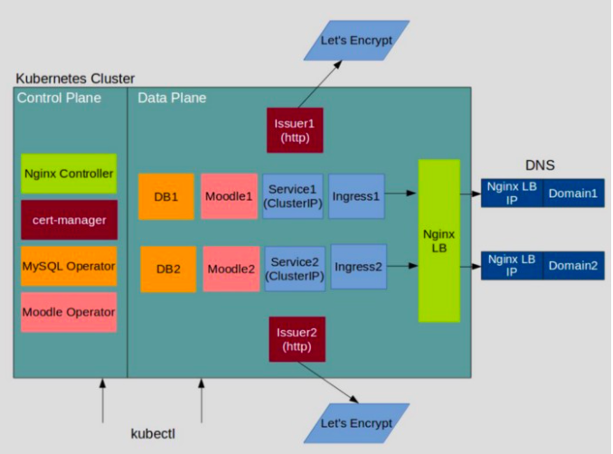
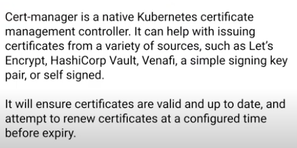

# Kubernetes :- The Production grade container orchestration  Engine 
## Info about Kubernetes
Kubernetes in the most powerfull container orchestration engine  
Its free for everyone  
## Developement  info 
<ul>
	<li> Developed by Google and CNCF  </li>
	<li> 7 June 2014 is the Release date  </li>
	<li> written in Go lang  </li>
	
</ul>

## Kubernetes SSL based application Hosting --

### Cert-manager 

### kubernetes Nativ controller for SSL 

