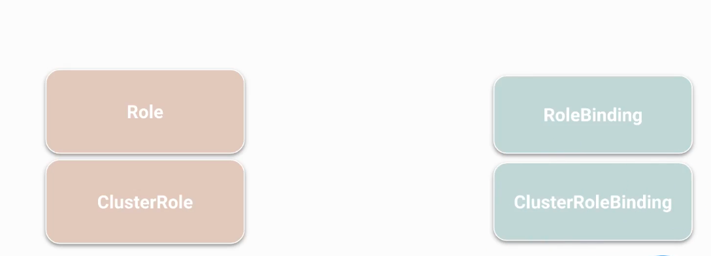
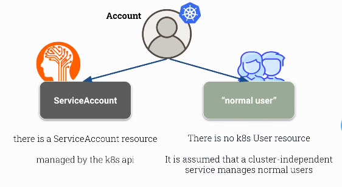
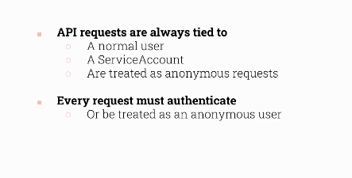
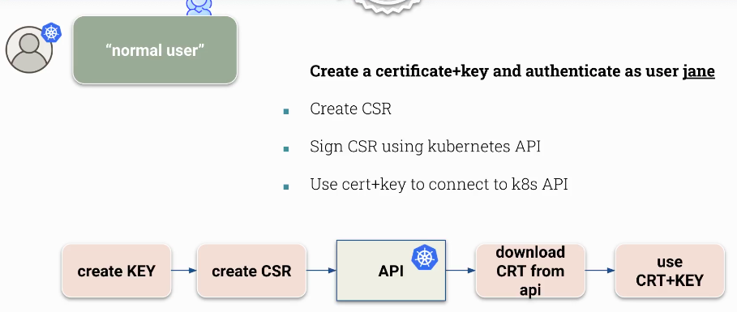
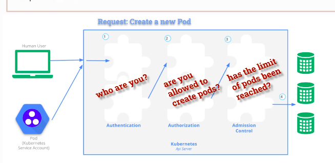

# Kubernetes :- The Production grade container orchestration  Engine 
## Info about Kubernetes
Kubernetes in the most powerfull container orchestration engine <br/>
Its free for everyone <br/>
## Developement  info 
<ul>
	<li> Developed by Google and CNCF  </li>
	<li> 7 June 2014 is the Release date  </li>
	<li> written in Go lang  </li>
	
</ul>


# Getting started with RBAC 

### Understanding -



### 

## create a service account 

```
 kubectl  create sa  test
```

## creating a role 

```
kubectl create role pod-reader --verb=get --verb=list --verb=watch --resource=pods

```

## Bind role to  account 

```
kubectl create rolebind mybind --role pod-reader --user=harry 
```

## accounts in k8s



## Normal user

### there are no api-resources in k8s to create users --

### we can integrate with external services or create CSR -- bcz user -- (cert + CN name)



### create a user ashutoshh and CSR and sign it 



### -- 

```
root@node155:~# mkdir /users/
root@node155:~# cd /users/
root@node155:/users# openssl  genrsa 2048 -out  ashu.key 
Extra arguments given.
genrsa: Use -help for summary.
root@node155:/users# openssl  genrsa  -out  ashu.key 2048 
Generating RSA private key, 2048 bit long modulus (2 primes)
....................................................+++++
...............................................+++++
e is 65537 (0x010001)
root@node155:/users# ls
ashu.key
root@node155:/users# openssl req -new -key ashu.key -out ashu.csr
You are about to be asked to enter information that will be incorporated
into your certificate request.
What you are about to enter is what is called a Distinguished Name or a DN.
There are quite a few fields but you can leave some blank
For some fields there will be a default value,
If you enter '.', the field will be left blank.
-----
Country Name (2 letter code) [AU]:
State or Province Name (full name) [Some-State]:
Locality Name (eg, city) []:
Organization Name (eg, company) [Internet Widgits Pty Ltd]:
Organizational Unit Name (eg, section) []:
Common Name (e.g. server FQDN or YOUR name) []:ashu
Email Address []:

Please enter the following 'extra' attributes
to be sent with your certificate request
A challenge password []:
An optional company name []:

```

### now we have ashu key and csr 

```
root@node155:/users# ls
ashu.csr  ashu.key

```

### now creating 

```
root@node155:/users# cat  ashu.csr   |  base64 -w 0 
LS0tLS1CRUdJTiBDRVJUSUZJQ0FURSBSRVFVRVNULS0tLS0KTUlJQ21UQ0NBWUVDQVFBd1ZERUxNQWtHQTFVRUJoTUNRVlV4RXpBUkJnTlZCQWdNQ2xOdmJXVXRVM1JoZEdVeApJVEFmQmdOVkJBb01HRWx1ZEdWeWJtVjBJRmRwWkdkcGRITWdVSFI1SUV4MFpERU5NQXNHQTFVRUF3d0VZWE5vCmRUQ0NBU0l3RFFZSktvWklodmNOQVFFQkJRQURnZ0VQQURDQ0FRb0NnZ0VCQUxhQlNNOEN3K3h6S2c1MVFRN2gKbzY5cE1uNTBXalNNNTNDWnRMY3JxSEo2N091TVpuSTNMdVB1K3NWakE5UUo0bnRXaktDNUdyMksvdnlLdndsOQowcW8rK2xZOW1JUG9vTzVp

```

### copy above data and use in request.csr file 

```
fire@node155:~$ kubectl apply -f request.yaml 
certificatesigningrequest.certificates.k8s.io/ashu created
fire@node155:~$ kube
kubeadm  kubectl  kubelet  
fire@node155:~$ kubectl get csr
NAME        AGE    SIGNERNAME                                    REQUESTOR              REQUESTEDDURATION   CONDITION
ashu        6s     kubernetes.io/kube-apiserver-client           minikube-user          24h                 Pending
csr-zpx84   3m9s   kubernetes.io/kube-apiserver-client-kubelet   system:node:minikube   <none>              Approved,Issued
fire@node155:~$ kubectl  certificate approve ashu
certificatesigningrequest.certificates.k8s.io/ashu approved
fire@node155:~$ kubectl get csr
NAME        AGE     SIGNERNAME                                    REQUESTOR              REQUESTEDDURATION   CONDITION
ashu        2m31s   kubernetes.io/kube-apiserver-client           minikube-user          24h                 Approved,Issued

```

### Now time for generating CRT for 

```
 kubectl get csr  ashu -oyaml # in certificate section 
```

### 

```
fire@node155:~$ kubectl get csr  ashu -oyaml  |   grep -i certificate  |  tail -2
  certificate: LS0tLS1CRUdJTiBDRVJUSUZJQ0FURS0tLS0tCk1JSURPakNDQWlLZ0F3SUJBZ0lSQU1aK0NtRWpIbTZxdm1YczRRL1VXOVF3RFFZSktvWklodmNOQVFFTEJRQXcKRlRFVE1CRUdBMVVFQXhNS2JXbHVhV3QxWW1WRFFUQWVGdzB5TWpBek1EUXhNVEV6TXpKYUZ3MHlNakF6TURVeApNVEV6TXpKYU1GUXhDekFKQmdOVkJBWVRBa0ZWTVJNd0VRWURWUVFJRXdwVGIyMWxMVk4wWVhSbE1TRXdId1lEClZRUUtFeGhKYm5SbGNtNWxkQ0JYYVdSbmFYUnpJRkIwZVNCTWRHUXhEVEFMQmdOVkJBTVRCR0Z6YUhVd2dnRWkKTUEwR0NTcUdTSWIzRFFFQkFRVUFBNElCRHdBd2dnRUtBb0lCQVFDMmdValBBc1BzY3lvT2RVRU80YU92YVRKKwpkRm8wak9kd21iUzNLNmh5ZXV6cmpHWnlOeTdqN3ZyRll3UFVDZUo3Vm95Z3VScTlpdjc4aXI4SmZkS3FQdnBXClBaaUQ2S0R1WW1zd2VRc0Q3bWM0MkZpMlBSZXVucXFUWWMvMlFXTHBneU1WU0NXQ0xwcVJibklZMDVIdXNja2wKc1MweldHK3RHTUFDZEJjaVFIaUZHNnN0aEdSYWNjM0hRSFhleUpzNVg3dU9hWWZYYzNCbVFNMGN5TDRYM05GbApYM09YeGxXaHlRTWxaOFh4VnZCS0VMNTJNbEtRM0lLYno4OWpNeFNIa2dGR3BVU2NsZ28yYnRDY09YSzNyYVVYClVadmJBMTBadi9YK3hoUlZoTVJMMWpQU1B5bkVISk82eXlpRzlIemFXWjhtZHlyWGt4OTF3Y0E0eVl6aEFnTUIKQUFHalJqQkVNQk1HQTFVZEpRUU1NQW9HQ0NzR0FRVUZCd01DTUF3R0ExVWRFd0VCL3dRQ01BQXdId1lEVlIwagpCQmd3Rm9BVXFLMUF

```

### create ashu.crt 

```
 echo "LS0tLS1CRUdJTiBDRVJUSUZJQ0FURS0tLS0tCk1JSURPakNDQWlLZ0F3SUJBZ0lSQU1aK0NtRWpIbTZxdm1YczRRL1VXOVF3RFFZSktvWklodmNOQVFFTEJRQXcKRlRFVE1CRUdBMVVFQXhNS2JXbHVhV3QxWW1WRFFUQWVGdzB5TWpBek1EUXhNVEV6TXpKYUZ3MHlNakF6TURVeApNVEV6TXpKYU1GUXhDekFKQmdOVkJBWVRBa0ZWTVJNd0VRWURWUVFJRXdwVGIyMWxMVk4wWVhSbE1TRXdId1lEClZRUUtFeGhKYm5SbGNtNWxkQ0JYYVdSbmFYUnpJRkIwZVNCTWRHUXhEVEFMQmdOVkJBTVRCR0Z6YUhVd2dnRWkKTUEwR0NTcUdTSWIzRFFFQkFRVUFBNElCRHdBd2dnRUtBb0lCQVFDMmdValBBc1BzY3lvT2RVRU80YU92YVRKKwpkRm8wak9kd21iUzNLNmh5ZXV6cmpHWnlOeTdqN3ZyRll3UFVDZUo3Vm95Z3VScTlpdjc4aXI4SmZkS3FQdnBXClBaaUQ2S0R1WW1zd2VRc0Q3bWM0MkZpMlBSZXVucXFUWWMvMlFXTHBneU1WU0NXQ0xwcVJibklZMDVIdXNja2wKc1MweldHK3RHTUFDZEJjaVFIaUZHNnN0aEdSYWNjM0hRSFhleUpzNVg3dU9hWWZYYzNCbVFNMGN5TDRYM05GbApYM09YeGxXaHlRTWxaOFh4VnZCS0VMNTJNbEtRM0lLYno4OWpNeFNIa2dGR3BVU2NsZ28yYnRDY09YSzNyYVVYClVadmJBMTBadi9YK3hoUlZoTVJMMWpQU1B5bkVISk82eXlpRzlIemFXWjhtZHlyWGt4OTF3Y0E0eVl6aEFnTUIKQUFHalJqQkVNQk1HQTFVZEpRUU1NQW9HQ0NzR0FRVUZCd01DTUF3R0ExVWRFd0VCL3dRQ01BQXdId1lEVlIwagpCQmd3Rm9BVXFLMUFtM29Xd2lnVWFrWUxVMW1WTGxFaUl1NHdEUVlKS29aSWh2Y05BUUVMQlFBRGdnRUJBR25CClcrUC9DVUpLYW5wQzlPSko0ZThSWi9zeHFhWWd3bU0vVnR2VDRqeGg4M1QxSWZiUHBTU2tPTFFPckx2Q0JFTW0KdmpHZzA0WSs0VjBmT1dMK095RFpJVThPbmhlTGQrSlBqYmtnck9yenZmU3VaUXEzMDFuWERHdlZVVWRnQ2xxVwpMcUFOeFhiZ0JTTHVpYWYyVktPTDMzc0YzYU51MVhKVGQzc0hISSs5VnV0Z2lJcXpQZ1VwZnRmT3hRNVN4ZEJ5CnVWbDh4U0RIdmJBaFZ3SGFpc0FjcThCc21lTTVDTTVWZmxoYnNNMlZIUHZTUitqbHFtbEFkVEk5c3crMmVjME8KRDEvWldIV1M1cUZhbU9tK1ZVN1ZuNFZ6dnpHclJXNERrR3A5b2dEam4wamVlU0NRNTBrNUsxNXdtbDFwZVFDeApmRGxkRXBTbG9PUnRacDFMcVJBPQotLS0tLUVORCBDRVJUSUZJQ0FURS0tLS0tCg=="  |  base64 -d  >ashu.crt 
```

### set credentials

```
 kubectl  config set-credentials  ashu --client-key=ashu.key --client-certificate=ashu.crt 
User "ashu" set.


fire@node155:~$ kubectl config view
apiVersion: v1
clusters:
- cluster:
    certificate-authority: /home/fire/.minikube/ca.crt
    extensions:
    - extension:
        last-update: Fri, 04 Mar 2022 03:13:04 PST
        provider: minikube.sigs.k8s.io
        version: v1.25.2
      name: cluster_info
    server: https://192.168.49.2:8443
  name: minikube
contexts:
- context:
    cluster: minikube
    extensions:
    - extension:
        last-update: Fri, 04 Mar 2022 03:13:04 PST
        provider: minikube.sigs.k8s.io
        version: v1.25.2
      name: context_info
    namespace: default
    user: minikube
  name: minikube
current-context: minikube
kind: Config
preferences: {}
users:
- name: ashu
  user:
    client-certificate: /home/fire/ashu.crt
    client-key: /home/fire/ashu.key
- name: minikube
  user:
    client-certificate: /home/fire/.minikube/profiles/minikube/client.crt
    client-key: /home/fire/.minikube/profiles/minikube/client.key
```

### 
```
kubectl  config set-credentials  ashu --client-key=ashu.key --client-certificate=ashu.crt --embed-certs  # to enject data without error 
```

### setting and using context --

```
fire@node155:~$ kubectl config get-contexts 
CURRENT   NAME       CLUSTER    AUTHINFO   NAMESPACE
*         minikube   minikube   minikube   default
fire@node155:~$ 
fire@node155:~$ kubectl config set-context ashu --user=ashu --cluster=minikube  
Context "ashu" created.
fire@node155:~$ kubectl config get-contexts 
CURRENT   NAME       CLUSTER    AUTHINFO   NAMESPACE
          ashu       minikube   ashu       
*         minikube   minikube   minikube   default

```

### checking resources from new user 

```
fire@node155:~$ kubectl config use-context ashu 
Switched to context "ashu".
fire@node155:~$ kubectl get  po 
Error from server (Forbidden): pods is forbidden: User "ashu" cannot list resource "pods" in API group "" in the namespace "default"

```

### role and rolebindings 

```
 96  kubectl -n test1 create role pod-control --verb=get,list  --resource=pod 
   97  kubectl -n test1 create rolebinding ashubind1  --role=pod-control  --user=ashu
   98  kubectl get roles -n test1
   99  kubectl get rolebinding -n test1

```

## API based connection -- big picture 
### connecting from pod to apiserver
```
 curl https://kubernetes -k  -H "Authorization: Bearer token-of-svc-acc"
```

### In max of the cases service account token doesn't require to be mounted inside the pod (default is mounting..)

'''
apiVersion: v1
kind: ServiceAccount
metadata:
  name: build-robot
automountServiceAccountToken: false
'''

## k8s api server FLow 



### API-request with respect to users


### Restrictions


### block anonymous users 

```
root@node155:/etc/kubernetes/manifests# pwd
/etc/kubernetes/manifests
root@node155:/etc/kubernetes/manifests# cat kube-apiserver.yaml 
apiVersion: v1
kind: Pod
metadata:
  annotations:
    kubeadm.kubernetes.io/kube-apiserver.advertise-address.endpoint: 192.168.1.155:6443
  creationTimestamp: null
  labels:
    component: kube-apiserver
    tier: control-plane
  name: kube-apiserver
  namespace: kube-system
spec:
  containers:
  - command:
    - kube-apiserver
    - --advertise-address=192.168.1.155
    - --allow-privileged=true
    - --anonymous-auth=false # this line added 
```

### sending request to secure port of apiserver

```
curl https:/ip:6443 --cacert ca.crt --cert client.crt --key client.key 
```


