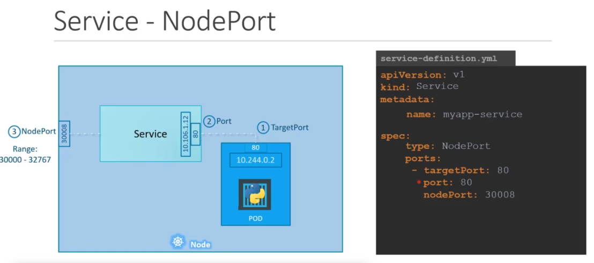

# Kubernetes :- The Production grade container orchestration  Engine 
## Info about Kubernetes
Kubernetes in the most powerfull container orchestration engine <br/>
Its free for everyone <br/>
## Developement  info 
<ul>
	<li> Developed by Google and CNCF  </li>
	<li> 7 June 2014 is the Release date  </li>
	<li> written in Go lang  </li>
	
</ul>

## Kubernetes multinode setup 
###  we have 4 machine , 1 master and 3 worker
## Pre-requisite 

### Disable selinux in all the nodes

```
  [root@master ~]# setenforce  0
  [root@master ~]# sed -i 's/SELINUX=enforcing/SELINUX=disabled/'  /etc/selinux/config
  
 ```
 
 ### Enable the kernel bridge for every system
 ```
 [root@master ~]# modprobe br_netfilter
 [root@master ~]# echo '1' > /proc/sys/net/bridge/bridge-nf-call-iptables
 ```
 ### Disable the swap 
 ```
 [root@master ~]# swapoff  -a
 ```
 ## Installing  docker and kubeadm in all the nodes 
 ```
 [root@master ~]# yum  install  docker kubeadm  -y
 ```
 ## Start service of docker & kubelet in all the nodes 
 ```
 [root@master ~]# systemctl enable --now  docker kubelet
 ```
 ## Do this only on Kubernetes Master 
 We are here using Calico Networking so we need to pass some parameter 
 you can start [Kubernetes_networking](https://kubernetes.io/docs/setup/production-environment/tools/kubeadm/create-cluster-kubeadm/) from this  <br/>
 
```
[root@master ~]# kubeadm  init --pod-network-cidr=192.168.0.0/16
```
### Use the output of above command and paste it to all the worker nodes

## Do this step in master node 
```
[root@master ~]# mkdir -p $HOME/.kube
[root@master ~]#  cp -i /etc/kubernetes/admin.conf $HOME/.kube/config
[root@master ~]# chown $(id -u):$(id -g) $HOME/.kube/config
```

##  Now apply calico project 
```
kubectl apply -f https://docs.projectcalico.org/v3.8/manifests/calico.yaml
```
After this all nodes will be ready in state

## Now you can check nodes status
```
[root@master ~]# kubectl get nodes
NAME                 STATUS   ROLES    AGE     VERSION
master.example.com   Ready    master   11m     v1.12.2
node1.example.com    Ready    <none>   9m51s   v1.12.2
node2.example.com    Ready    <none>   9m25s   v1.12.2
node3.example.com    Ready    <none>   9m3s    v1.12.2
```

Good luck guys !!

##  Now time for Kubernetes Services  

This component created  to access application from inside and outside cluster  <br/>
### Their are 3 major types of services in Kubernetes 
<ul>
	<li> ClusterIP :- To access internal from nodes </li>  
	<li> LoadBalancer  :- To balance load in case of multiPod apps </li>
	<li> NodePort :-  To access application from outside </li>

</ul>


###  A visual look to serivce 


##  Deploy service from a yaml file
```
[root@station132 k8s]# kubectl create -f  sampleservice.yml 
service/servicefirst1 created

[root@station132 k8s]# kubectl  get  service
NAME            TYPE        CLUSTER-IP    EXTERNAL-IP   PORT(S)        AGE
kubernetes      ClusterIP   10.96.0.1     <none>        443/TCP        4d12h
servicefirst1   NodePort    10.99.68.91   <none>        80:30008/TCP   8s

[root@station132 k8s]# kubectl  get  svc
NAME            TYPE        CLUSTER-IP    EXTERNAL-IP   PORT(S)        AGE
kubernetes      ClusterIP   10.96.0.1     <none>        443/TCP        4d12h
servicefirst1   NodePort    10.99.68.91   <none>        80:30008/TCP   11s

```

###  creating  service from command line 
```
[root@station132 k8s]# kubectl  create  service   nodeport   my --tcp=80
service/my created

[root@station132 k8s]# kubectl get svc
NAME            TYPE        CLUSTER-IP     EXTERNAL-IP   PORT(S)        AGE
kubernetes      ClusterIP   10.96.0.1      <none>        443/TCP        4d12h
my              NodePort    10.99.104.65   <none>        80:31050/TCP   6s
servicefirst1   NodePort    10.99.68.91    <none>        80:30008/TCP   5m3s

[root@station132 k8s]# kubectl get svc -o wide
NAME            TYPE        CLUSTER-IP     EXTERNAL-IP   PORT(S)        AGE     SELECTOR
kubernetes      ClusterIP   10.96.0.1      <none>        443/TCP        4d12h   <none>
my              NodePort    10.99.104.65   <none>        80:31050/TCP   26s     app=my
servicefirst1   NodePort    10.99.68.91    <none>        80:30008/TCP   5m23s   name=myapp
```

