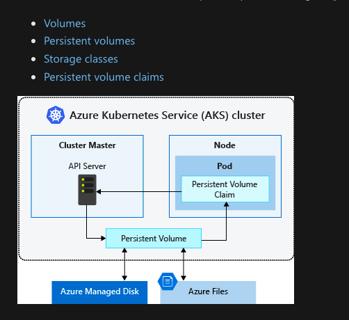
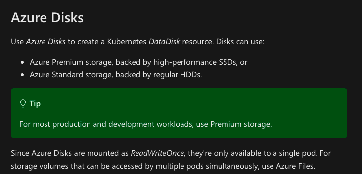
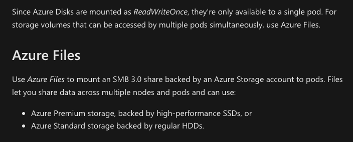
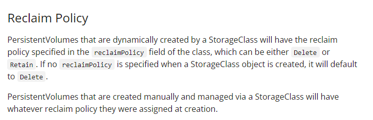

# Kubernetes :- The Production grade container orchestration  Engine 
## Info about Kubernetes
Kubernetes in the most powerfull container orchestration engine  
Its free for everyone  
## Developement  info 
<ul>
	<li> Developed by Google and CNCF  </li>
	<li> 7 June 2014 is the Release date  </li>
	<li> written in Go lang  </li>
	
</ul>

## AKS -- Storage support 

### View mode 

### Azure Disk with ReadWriteOnce

### AZURE files storage 

### AKS based storage link 

[Storage](https://docs.microsoft.com/en-us/azure/aks/concepts-storage)

### DYnamic Provisoining of storage class --

