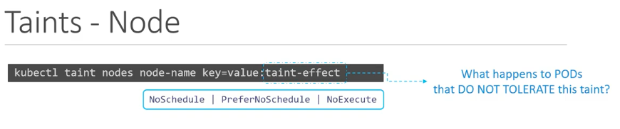
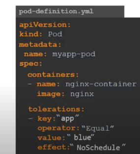

# Taints and tolerations

## taints

<b>  Meaning preventing all pods to be scheduled on a particular node  where we have applied taints </b>

## Taints a Node 



## taint effects 

<b> Meaning what will happen to the pods if they do not tolerate to taints </b>

### There are 3 taints effect

<ol>
	<li> Noschedule </li> -->> k8s schedular will never schedule a pods in taints node 
	<li> PreferNoschedule </li> -->> k8s schedular will try not to schedule pods in taints node but that is not guaranteed 
	<li> Noexecute </li> --->>  No new pods will be scheduled on the node and existing pod will be evicted 
</ol>


## Tolerations 

<b> applied on pods so that they can tolerate to the node that has been taints  </b>

## apply tolerations on the pod 



## Remove taints from node 

```
❯ kubectl  taint node  ip-172-31-75-3.ec2.internal  x=hellon:NoSchedule-
node/ip-172-31-75-3.ec2.internal untainted

```


# Important point 

<i> taints means it is not going to accept all the pods that can not tolerate but in some cases pods can go in non taints node as well </i>

