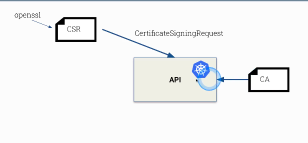

# Kubernetes :- The Production grade container orchestration  Engine 
## Info about Kubernetes
Kubernetes in the most powerfull container orchestration engine <br/>
Its free for everyone <br/>
## Developement  info 
<ul>
	<li> Developed by Google and CNCF  </li>
	<li> 7 June 2014 is the Release date  </li>
	<li> written in Go lang  </li>
	
</ul>

## Kubernetes multinode setup 
###  we have 4 machines; 1 master and 3 worker nodes
## Pre-requisite 

### Disable selinux in all the nodes

```
  [root@master ~]# setenforce  0
  [root@master ~]# sed -i 's/SELINUX=enforcing/SELINUX=disabled/'  /etc/selinux/config
  
 ```
 
 ### Enable the kernel bridge for every system
 ```
 [root@master ~]# modprobe br_netfilter
 [root@master ~]# echo '1' > /proc/sys/net/bridge/bridge-nf-call-iptables
 ```
 ### Disable the swap 
 ```
 [root@master ~]# swapoff  -a
 ```
 ## Installing  docker and kubeadm in all the nodes 
 ```
 [root@master ~]# yum  install  docker kubeadm  -y
 ```
 ## if kubeadm is not present in your repo 
 you can browse this link [kubernetes repo](https://kubernetes.io/docs/setup/production-environment/tools/kubeadm/install-kubeadm/)  <br/>
 
## yum can be configured by running this command 
```
cat  <<EOF  >/etc/yum.repos.d/kube.repo
[kube]
baseurl=https://packages.cloud.google.com/yum/repos/kubernetes-el7-x86_64
gpgcheck=0
EOF
```
 
 ## Start service of docker & kubelet in all the nodes 
 ```
 [root@master ~]# systemctl enable --now  docker kubelet
 ```
 ## Do this only on Kubernetes Master 
 We are here using Calico Networking, so we need to pass some parameter 
 you can start [Kubernetes_networking](https://kubernetes.io/docs/setup/production-environment/tools/kubeadm/create-cluster-kubeadm/) from this  <br/>
 
```
[root@master ~]# kubeadm  init --pod-network-cidr=192.168.0.0/16
```
## this is optional 
### In case of cloud services like aws, azure if want to bind public with certificate of kubernetes 
```
[root@master ~]# kubeadm init --pod-network-cidr=192.168.0.0/16 --apiserver-advertise-address=0.0.0.0   --apiserver-cert-extra-sans=publicip,privateip,serviceip
```

## Note: IF you want to bind your controlplane with public IP also 

```
[root@master ~]# kubeadm init --pod-network-cidr=192.168.0.0/16 --apiserver-advertise-address=0.0.0.0   --apiserver-cert-extra-sans=publicip,privateip,serviceip  --control-plane-endpoint=publicIP
```

### Use the output of above command and paste it to all the worker nodes

## Do this step in master node 
```
[root@master ~]# mkdir -p $HOME/.kube
[root@master ~]#  cp -i /etc/kubernetes/admin.conf $HOME/.kube/config
[root@master ~]# chown $(id -u):$(id -g) $HOME/.kube/config
```

##  Now apply calico project 
```
kubectl apply -f https://docs.projectcalico.org/v3.8/manifests/calico.yaml
```
## Or Download 3.16 latest version as now october 2020 

```
wget https://docs.projectcalico.org/manifests/calico.yaml
kubectl apply -f calico.yaml

```

# INstalling calico in minikube cluster..

```
minikube start --network-plugin=cni --cni=calico

```

## ADding new node in minikube 

```
  minikube node add
```

After this all nodes will be in ready state

## Now you can check nodes status
```
[root@master ~]# kubectl get nodes
NAME                 STATUS   ROLES    AGE     VERSION
master.example.com   Ready    master   11m     v1.12.2
node1.example.com    Ready    <none>   9m51s   v1.12.2
node2.example.com    Ready    <none>   9m25s   v1.12.2
node3.example.com    Ready    <none>   9m3s    v1.12.2
```

# Getting started with RBAC 

## create a service account 

```
 kubectl  create sa  test
```

## creating a role 

```
kubectl create role pod-reader --verb=get --verb=list --verb=watch --resource=pods

```

## Bind role to service account 

```

### connecting from pod to apiserver
```
 curl https://kubernetes -k  -H "Authorization: Bearer token-of-svc-acc"
```

### In max of the cases service account token doesn't require to be mounted inside the pod (default is mounting..)

'''
apiVersion: v1
kind: ServiceAccount
metadata:
  name: build-robot
automountServiceAccountToken: false
'''

## k8s api server FLow 


### API-request with respect to users



### Restrictions


### block anonymous users 

```
root@node155:/etc/kubernetes/manifests# pwd
/etc/kubernetes/manifests
root@node155:/etc/kubernetes/manifests# cat kube-apiserver.yaml 
apiVersion: v1
kind: Pod
metadata:
  annotations:
    kubeadm.kubernetes.io/kube-apiserver.advertise-address.endpoint: 192.168.1.155:6443
  creationTimestamp: null
  labels:
    component: kube-apiserver
    tier: control-plane
  name: kube-apiserver
  namespace: kube-system
spec:
  containers:
  - command:
    - kube-apiserver
    - --advertise-address=192.168.1.155
    - --allow-privileged=true
    - --anonymous-auth=false # this line added 
```

### sending request to secure port of apiserver

```
curl https:/ip:6443 --cacert ca.crt --cert client.crt --key client.key 
```


