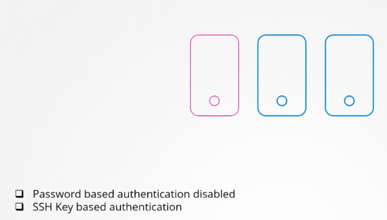
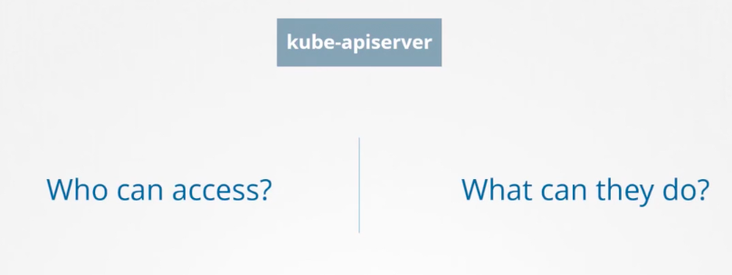
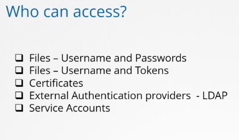
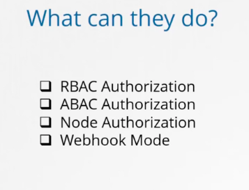
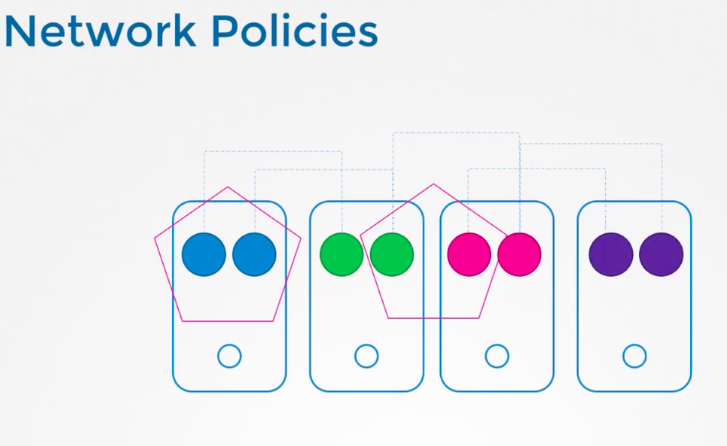

## Kubernetes security primitives 

### Host secure 

### First Line of Defence -- Secure kube-apiserver

### kube-apiserver -- can be access by users using below given options 

### How to control user actions 

### k8s application level access can be restricted using Network policies 

