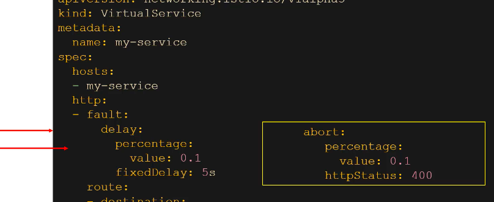
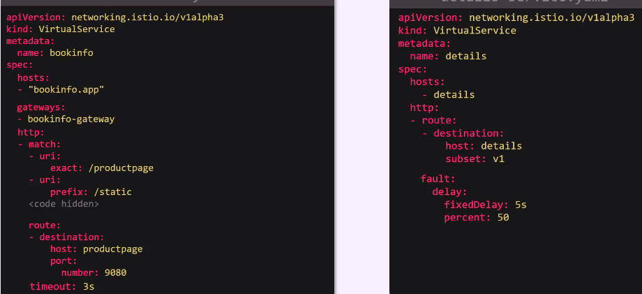
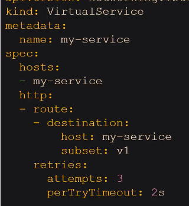
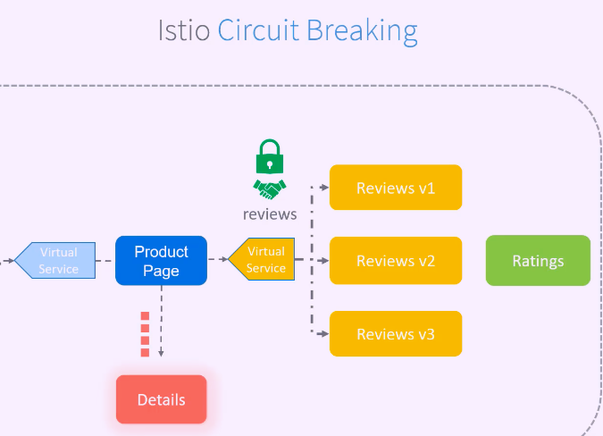

## Fault injection 

### For testing our application we can use fault injection -- Using virtual service 

#### there are two type of fault injection 

<ol>
  <li>delay</li>
  <li>abort</li>
</ol>

## Timeout --

### Problem 
 
 Sometime a particular micro service is having slow response so the dependent micro service will also be affect and user will be facing delay in response 
 
 
### Solution 

We can Introduce timeout so that dependent micro service must not wait they can show some error 

 we have to write in Virtual service 

## Retry 

### Problem 

 Generally developers use to write retry logic if one micro service is failing in response 

 So Istio is offering retry logic so you don't have to add this in code 

### solution 

 we can introduction retry in virtual service 

## Circuit breaking 

### problem 

 If a particular micro service is not responding then the dependent micro service will be having a collection of request 

 which means requests will be pilled up 

### Solution 

 if we mark those request to be servered or consumed then this is called circuit breaking 

 circuit breaker are configured in Destination rules 

### Demo 

