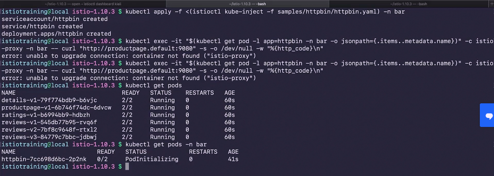
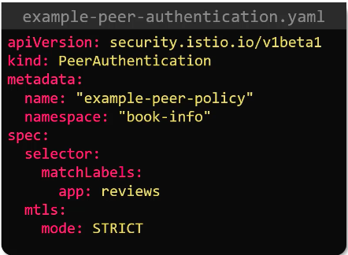
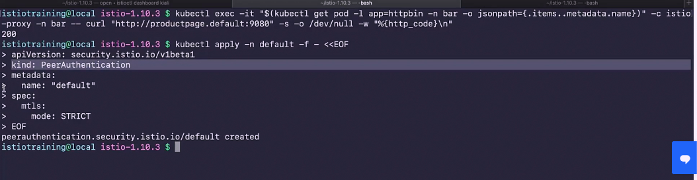
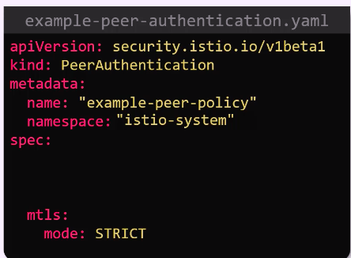
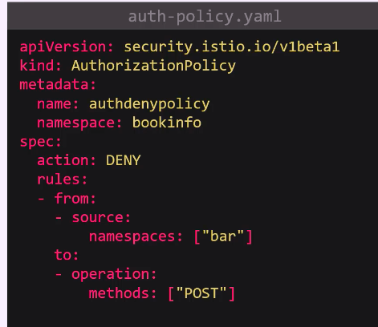
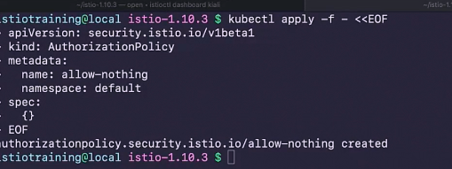
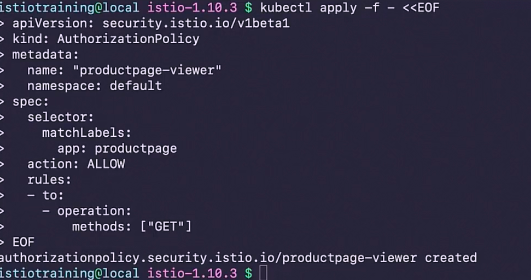
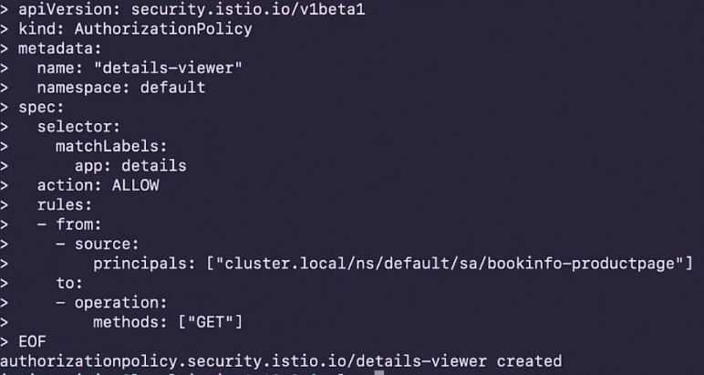
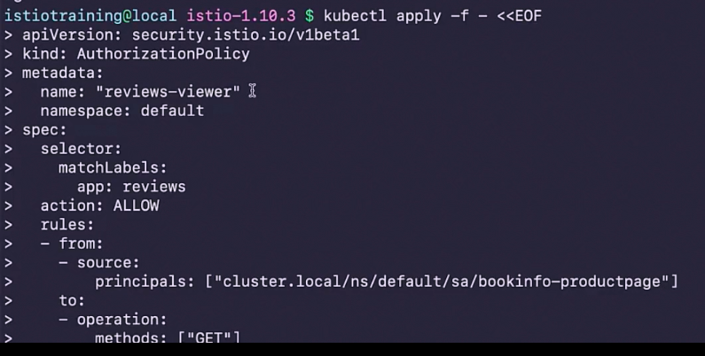
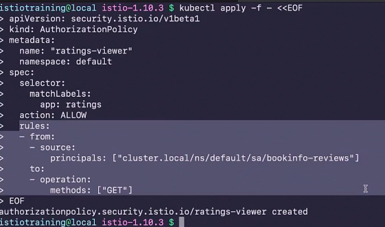

### accessing product page from different namespace 

### apply Mutul TLS for particular microservice using peer authentication 

### By default all namespace can connect entire service so we are creating peerauthentication policy for our namespace 

### Apply mutul tls in entire Istio mesh 

## Authorization 

### block authorization request using authorization policy 

### block everything 

### allow get request for home page 

### allow service account of product page to access details page

### allow product page to review 

### allow review to access ratings 

